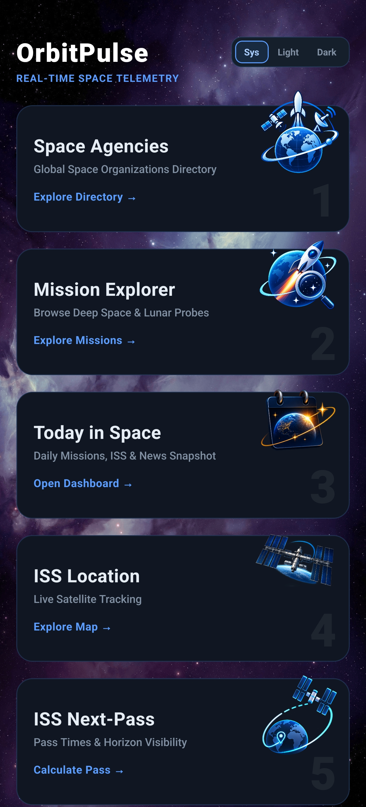
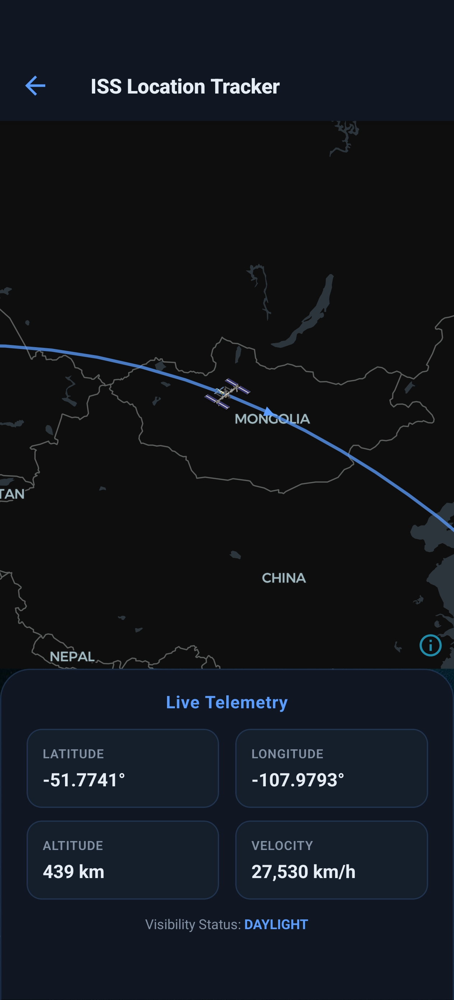
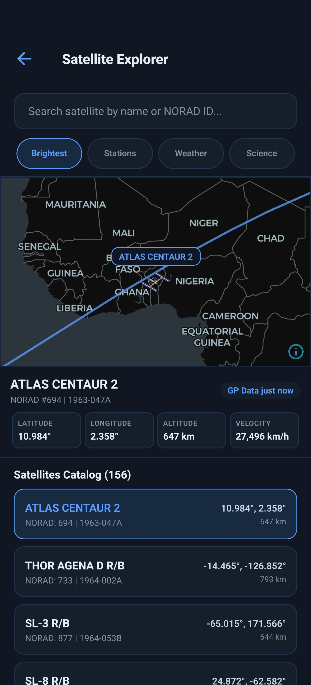
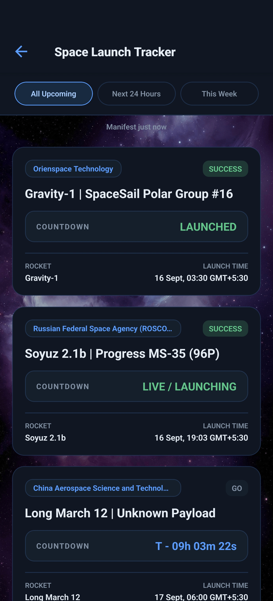
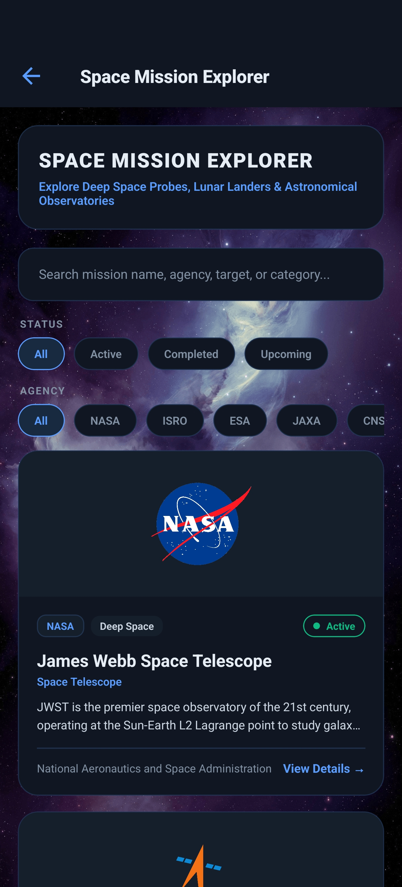

# OrbitPulse

OrbitPulse is a modern, real-time space operations and satellite tracking application built with React Native and Expo SDK 57. It provides live telemetry, orbital path visualization, near-Earth object tracking, launch schedules, spaceflight news, and detailed space agency mission overviews across iOS and Android.

---

## Table of Contents

- [Features](#features)
- [Tech Stack](#tech-stack)
- [Data & API Sources](#data--api-sources)
- [Application Screens](#application-screens)
- [Project Structure](#project-structure)
- [Offline & Cache Behavior](#offline--cache-behavior)
- [Setup & Installation](#setup--installation)
- [Environment Variables](#environment-variables)
- [Running the App](#running-the-app)
- [Security Guidelines](#security-guidelines)
- [Credits & Attributions](#credits--attributions)
- [License](#license)

---

## Features

- **Live ISS Telemetry & Tracking**: Real-time International Space Station positioning, velocity, altitude, and orbital trail visualization powered by MapLibre GL.
- **ISS Pass Predictions**: Observer-specific topocentric pass predictions with directional azimuths, elevation angles, and solar illumination visibility.
- **Satellite Explorer**: Track visual satellites and orbital groups with real-time propagation from CelesTrak Keplerian GP elements.
- **Near-Earth Object (NEO) Monitor**: Real-time telemetry on approaching asteroids, miss distances, estimated diameters, and threat scores powered by NASA's NeoWs API.
- **Launch Schedule Tracker**: Comprehensive countdowns, launch site details, rocket configurations, and webcast links for upcoming global space launches.
- **Spaceflight News Feed**: Aggregated space news with search and filter capabilities powered by Spaceflight News API (SNAPI v4).
- **Space Agencies & Missions Directory**: Curated profiles, agency assets, and operational status for major space agencies (NASA, ISRO, ESA, JAXA, CNSA) and iconic missions (JWST, Chandrayaan-3, Perseverance, Artemis I).
- **Dark Operations Aesthetic**: Curated color palette and dynamic dark/light theme switcher optimized for space telemetry visualization.

---

## Screenshots

### Home


### ISS Locator


### Satellite Explorer


### Launch Tracker


### Mission Explorer


---

## Tech Stack

- **Core Framework**: [React Native](https://reactnative.dev/) (`0.86.3`) + [Expo SDK 57](https://docs.expo.dev/) (`~57.0.22`)
- **Language**: [TypeScript](https://www.typescriptlang.org/) (`~6.0.3`)
- **Navigation**: [React Navigation v7](https://reactnavigation.org/) (`@react-navigation/native` & `@react-navigation/native-stack`)
- **Mapping & Geospatial**: [MapLibre GL React Native](https://github.com/maplibre/maplibre-react-native) (`^10.0.0`)
- **Local Storage**: [@react-native-async-storage/async-storage](https://react-native-async-storage.github.io/async-storage/) (`^2.2.0`)
- **Safe Area & UI Components**: `react-native-safe-area-context` & `react-native-screens`

---

## Data & API Sources

OrbitPulse integrates with open, real-time public telemetry endpoints:

| Service / Data Provider | Data Type | Authentication | Endpoint / Provider |
| :--- | :--- | :--- | :--- |
| **NASA NeoWs API** | Near-Earth Object & Asteroid Telemetry | API Key (`EXPO_PUBLIC_NASA_API_KEY`) | [api.nasa.gov](https://api.nasa.gov/) |
| **CelesTrak** | Satellite Orbital Elements (General Perturbations GP) | Public / HTTPS | [celestrak.org](https://celestrak.org/) |
| **Where The ISS At?** | Live ISS Position & Orbit Parameters | Public / HTTPS | [wheretheiss.at](https://wheretheiss.at/) |
| **Launch Library 2** | Upcoming Global Space Launches | Public / HTTPS | [ll.thespacedevs.com](https://ll.thespacedevs.com/) |
| **Spaceflight News API (SNAPI v4)** | Space News Articles & Coverage | Public / HTTPS | [spaceflightnewsapi.net](https://spaceflightnewsapi.net/) |

---

## Application Screens

The application includes 16 specialized screens organized into distinct operational modules:

1. **HomeScreen**: Operations dashboard with quick navigation, live telemetry summaries, and quick status metrics.
2. **TodayInSpaceScreen**: Highlights of current orbital events, upcoming passes, and space news.
3. **ISSlocatorScreen**: Real-time ISS map view with orbital path line, velocity, altitude, and directional vectors.
4. **ISSPassScreen**: Sky pass predictor for the observer's location with pass duration and visibility details.
5. **SatelliteExplorerScreen**: Interactive satellite tracking map categorized by satellite group (Visual, Weather, Science, Communication).
6. **SpacecraftTrackerScreen**: Orbital view and parameters for active human and scientific spacecraft.
7. **SpacecraftDetailsScreen**: Deep-dive technical specifications and telemetry for specific spacecraft.
8. **MeteorScreen**: Near-Earth asteroid monitoring feed with sorting by threat score and close approach date.
9. **AsteroidDetailsScreen**: Detailed trajectory, size estimate, and close approach metrics for individual asteroids.
10. **LaunchTrackerScreen**: Chronological list of upcoming space launches with dynamic countdown tickers.
11. **LaunchDetailsScreen**: Complete launch breakdown including pad location, rocket configuration, mission objectives, and webcast links.
12. **SpaceNewsScreen**: Real-time space news stream with search filter for ISRO and global space agencies.
13. **SpaceAgenciesScreen**: Overview of international space agencies (NASA, ISRO, ESA, JAXA, CNSA) and agency profiles.
14. **MissionExplorerScreen**: Catalog of landmark space exploration missions categorized by destination and target.
15. **MissionDetailsScreen**: Deep dive into individual space missions (JWST, Chandrayaan-3, Perseverance, etc.).
16. **UpdatesScreen**: System status, telemetry cache parameters, and theme preferences.

---

## Project Structure

```
OrbitPulse/
├── assets/                  # App branding, icons, background images, and agency logos
├── src/
│   ├── context/            # Global React Context providers (ThemeContext)
│   ├── data/               # Static dataset definitions (missions, spacecraft, agencies)
│   ├── hooks/              # Custom React hooks (useISSTelemetry, useSatelliteExplorer)
│   ├── navigation/         # React Navigation stack config (AppNavigator)
│   ├── screens/            # Application screen components (16 operational views)
│   ├── services/           # Data fetching and persistent caching services
│   ├── theme/              # Design system color tokens, typography, and styles
│   ├── types/              # TypeScript interfaces and type definitions
│   └── utils/              # Helper utilities (time formatting, error handling, agency icons)
├── App.tsx                 # Root application component
├── index.ts                # Application entry point
├── app.json                # Expo project configuration
├── package.json            # Dependencies and scripts
└── tsconfig.json           # TypeScript configuration
```

---

## Offline & Cache Behavior

OrbitPulse implements a persistent caching layer powered by `@react-native-async-storage/async-storage` via `src/services/cacheService.ts`.

- **Graceful Fallbacks**: When API network requests fail or rate limits (HTTP 429) occur, the application seamlessly serves previously cached telemetry snapshots.
- **Cache Stale Indicators**: Cache entries track creation timestamps and display stale indicators when data exceeds freshness thresholds (e.g., 24 hours for orbital data, 12 hours for news).
- **Sanitized Errors**: Raw exceptions, socket failures, and HTTP error codes are converted into user-friendly message strings using `src/utils/errorUtils.ts`.

---

## Setup & Installation

### Prerequisites

- [Node.js](https://nodejs.org/) (v18.x or later)
- [npm](https://www.npmjs.com/) or [yarn](https://yarnpkg.com/)
- [Expo Go app](https://expo.dev/client) on your mobile device OR Android Studio / Xcode for emulators.

### Installation Steps

1. **Clone the Repository**:
   ```bash
   git clone https://github.com/your-username/OrbitPulse.git
   cd OrbitPulse
   ```

2. **Install Dependencies**:
   ```bash
   npm install
   ```

---

## Environment Variables

OrbitPulse requires a NASA API key for Near-Earth Object (NEO) telemetry fetching.

1. **Create a `.env` file** in the project root directory:
   ```bash
   touch .env
   ```

2. **Add your NASA API key**:
   ```env
   EXPO_PUBLIC_NASA_API_KEY=YOUR_NASA_API_KEY_HERE
   ```

> Get a free API key at [api.nasa.gov](https://api.nasa.gov/).

---

## Running the App

### Start Development Server
```bash
npm start
# OR
npx expo start
```

### Run on Android
```bash
npm run android
# OR
npx expo run:android
```

### Run on iOS
```bash
npm run ios
# OR
npx expo run:ios
```

---

## Security Guidelines

- **Environment File Security**: `.env` and `.env*.local` files are included in `.gitignore` and **must never be committed** to any source control system.
- **Client-Side Variables**: Variables prefixed with `EXPO_PUBLIC_` are bundled into the application binary at build time. Use only public, client-side API keys (such as NASA's public rate-limited key). Never expose private server secrets, AWS keys, or master database passwords in React Native client applications.
- **No Hardcoded Credentials**: Ensure no developer API keys or private tokens are hardcoded inside JavaScript or TypeScript source files.

---

## Credits & Attributions

OrbitPulse relies on telemetry and data provided by the international space community:

- **NASA (National Aeronautics and Space Administration)** — Near-Earth Object Web Service (NeoWs) & mission assets.
- **CelesTrak** — Two-Line Element (TLE) & General Perturbations (GP) satellite orbital elements.
- **Where The ISS At?** — Real-time ISS position data.
- **The Space Devs (Launch Library 2)** — Launch schedule and rocket configuration data.
- **Spaceflight News API (SNAPI)** — Spaceflight news articles and coverage.
- **ISRO, ESA, JAXA, CNSA** — Mission and agency reference information.

---

## License

This project is licensed under the **MIT License**. See the [LICENSE](LICENSE) file for complete details.

---

Developed by [dslord](https://github.com/dslord)